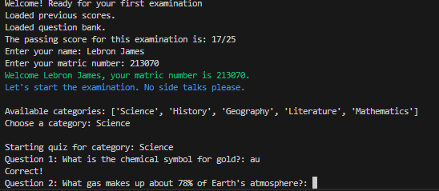
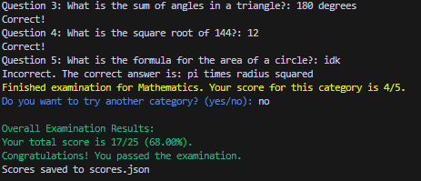

Quiz Application
 A simple Python-based quiz application that tests users on various categories (Science, History, Geography) and saves their scores to a JSON file. This is my first project, designed to provide an interactive quiz experience with input validation and colorized output.

 ## Features
 - Multiple quiz categories with randomized questions.
 - Input validation for student name and matric number.
 - Score tracking per category and overall.
 - Persistent score storage in a JSON file.
 - Colorized console output using the `colorama` library.

 ## Screenshots
 
 

 ## Installation
 1. Ensure you have Python 3.6 or later installed.
 2. Install the required dependency:
    ```bash
    pip install colorama
    ```
 3. Clone this repository:
    ```bash
    git clone https://github.com/Ifeanyi57/Quiz-Project.git
    cd Quiz-Project
    ```

 ## Usage
 1. Run the quiz application:
    ```bash
    python quiz.py
    ```
 2. Follow the prompts to:
    - Enter your name and matric number.
    - Choose a quiz category (Science, History, Literature, Mathematics or Geography).
    - Answer questions and view your score.
    - Optionally try another category.
 3. Scores are saved to `scores.json` after completing the quiz.

 ## File Structure
 - `quiz.py`: The main Python script containing the quiz logic.
 - `questions.json`: The question bank in JSON format, containing questions and answers for each category.
 - `README.md`: This file, providing project documentation.
 - `.gitignore`: Excludes files like `scores.json` and `__pycache__/` from being committed.
 - `requirements.txt`: Lists dependencies (e.g., `colorama`).
 - `screenshots/`: Contains images of the quiz in action.

 ## Adding New Questions
 To add new questions or categories, edit `questions.json`. The file has the following structure:
 ```json
 {
     "CategoryName": [
         {"question": "Your question here?: ", "answer": "correct answer"},
         ...
     ],
     ...
 }
 ```
 - Add new categories or questions as needed, ensuring each question has a `question` and `answer` field.
 - Save the file and run `quiz.py` to use the updated question bank.

 ## Dependencies
 - `colorama==0.4.6`: For colorized console output.
 - Standard Python libraries: `random`, `re`, `json`, `os`, `time`.

 ## Notes
 - The `scores.json` file is generated automatically when a user completes the quiz and is excluded from the repository via `.gitignore` to protect user data.
 - Ensure `questions.json` is present in the project directory before running the script.

 ## License
 MIT License

 Copyright (c) 2025 [Ifeanyi]
